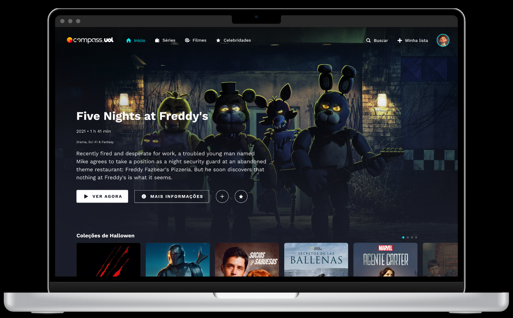

    <h1>Desafio - Recriação de um Site de Streaming - Compass Flix</h1>
    

**Descrição do desafio:**

Você precisa recriar a página mencionada acima, um site de streaming fictício, com informações sobre filmes, séries e atores, mantendo-se fiel ao seu design original usando React.

É recomendado usar [Vite](https://vitejs.dev/guide/) para inicializar seu aplicativo React.

**Adicione colaboradores ao seu repositório GitHub:**

- [**ycarlosedu**](https://github.com/ycarlosedu)
- [**isadfrn**](https://github.com/isadfrn)
- [**gustavoeyros**](https://github.com/gustavoeyros)
- [**thiago-compasso**](https://github.com/thiago-compasso)

**Prazo:**

Até 11/08 às 12h00 (quarta-feira).

**Protótipos Navegáveis:**

Você pode acessar os protótipos navegáveis nos seguintes links:

- [**Protótipo para Desktop**](https://www.figma.com/proto/Jz1kalLo4N6bnNDrYjgpBR/Compass-Video---Challenge-II?type=design&node-id=18-285&t=luJehLvJyj3nFGpB-1&scaling=scale-down&page-id=0%3A1&ponto-inicial-node-id=18%3A285&mode=design)
- [**Protótipo para Celular**](https://www.figma.com/proto/Jz1kalLo4N6bnNDrYjgpBR/Compass-Video---Challenge-II?type=design&node-id=2633-3625&t=iGrWFl8zbLcCRtOs-1&scaling=scale-down&page-id=207%3A995&ponto-de-ponto-id-id=2633%3A3625&mode=design)

  
Descrição das páginas:

  

      
  
Login

  
  - Você precisa usar [métodos de autenticação](https://developer.themoviedb.org/reference/authentication-how-do-i-generate-a-session-id) na API TMDB para lidar com a autenticação/sessão do usuário.
  - Após o login com TMDB, a página irá redirecionar novamente para o seu projeto.

  
Header

  - Deveria:
    - Navbar (para casa, shows, filmes e atores).
    - Botão [Pesquisar](https://developer.themoviedb.org/reference/search-multi).
    - Botão Minha lista (redireciona para a página MinhasListas).
    - Botão Usuário (mostra um menu com algumas opções, apenas a opção de logout deve estar funcionando).

  
Home

  - Precisa mostrar um filme/programa aleatório em segundo plano. O filme de fundo possui quatro botões:
    - VEJA AGORA (abra um player de vídeo, pode ser um vídeo aleatório, um trailer do filme).
    - MAIS INFORMAÇÕES (redireciona para a página do filme).
    - ADICIONAR À LISTA DE ASSISTÊNCIA.
    - FILME / SHOW FAVORITO.
  - Deve mostrar recomendações de filmes/programas, como coleção de Halloween, filmes/programas populares, fique à vontade para mostrar o que preferir.

  
Actors

  - Precisa mostrar um filme/programa aleatório em segundo plano. A mesma funcionalidade do Homepage.
  - Deve listar alguns atores/artistas e os filmes/séries com os quais trabalharam, você pode usar [Popular](https://developer.themoviedb.org/reference/person-popular-list) (Listas de Pessoas).

  
Tv Shows

  - Precisa mostrar um show aleatório em segundo plano. A mesma funcionalidade do Homepage.
  - Caso tenha recomendações de programas de TV, você pode usar [Airing TodayGET](https://developer.themoviedb.org/reference/tv-series-airing-today-list), [On The AirGET](https://developer.themoviedb.org/reference/tv-series-on-the-air-list), [PopularGET](https://developer.themoviedb.org/reference/tv-series-popular-list), [Melhor avaliado](https://developer.themoviedb.org/reference/tv-series-top-rated-list) ou outro de sua preferência.

  
Movies

  - Precisa mostrar um filme aleatório em segundo plano. A mesma funcionalidade do Homepage.
  - Deve ter recomendações de filmes, você pode usar [Now PlayingGET,](https://developer.themoviedb.org/reference/movie-now-playing-list) [PopularGET,](https://developer.themoviedb.org/reference/movie-popular-list) [Top RatedGET,](https://developer.themoviedb.org /reference/movie-top-rated-list) [Próximos](https://developer.themoviedb.org/reference/movie-upcoming-list) ou outro de sua preferência.

  
Collections

  
  - Ao clicar em um cartão de coleta, você é redirecionado para esta página.
  - Mostre as [informações da coleção](https://developer.themoviedb.org/reference/collection-details) e liste os filmes da coleção.

  
Tv Show Infos

  
  - Deveria ter as [informações do programa](https://developer.themoviedb.org/reference/tv-series-details), listando suas temporadas e outras [semelhantes](https://developer.themoviedb.org/reference/tv -série semelhante) mostra.

  
Season Infos

  - Deveria ter as [informações da temporada](https://developer.themoviedb.org/reference/tv-season-details), listando seus episódios.
  - Ao clicar em um episódio, mostra ao player algum vídeo (trailer ou aleatório).

  
Movie Infos

  
  - Deve ter as [informações do filme](https://developer.themoviedb.org/reference/movie-details) e outros filmes [semelhantes](https://developer.themoviedb.org/reference/movie-similar).

  
Search

  - Após pesquisar algo no cabeçalho, você será redirecionado para esta página.
  - Mostra os resultados do que o usuário estava pesquisando.

  
My Lists

  - Mostrar listas de observação e favoritos do usuário (para filmes e programas).

  
Os requisitos OBRIGATÓRIOS são:

  ### Use a API [TMDB](https://developer.themoviedb.org/reference/intro/getting-started)
  Use a API TMDB para lidar com a autenticação do usuário e solicitar chamadas para obter informações de filmes/programas de TV/artistas. A documentação fornece todas as informações necessárias para aplicar esta funcionalidade.

  ### TypeScript com React (arquivos tsx)
  Utilize TypeScript com arquivos tsx no projeto.

  ### [React Router](https://reactrouter.com/en/main)
  Use o React Router para criar o roteamento, a menos que esteja usando Next.js.

  ### Redirecionamento ao clicar em um cartão de filme
  Ao clicar em um cartão de filme, redirecione o usuário para a rota específica que contém as informações detalhadas.

  ### Crie controles deslizantes para exibir os filmes
  Crie controles deslizantes para exibir os filmes. Recomenda-se a biblioteca [Splide](https://splidejs.com/), mas você pode usar a biblioteca de sua preferência.

  ### Solicitação GET para renderizar os filmes
  Para renderizar os filmes, faça uma solicitação GET para a API TMDB.

  ### Repositório privado no Github
  Crie um repositório privado no seu Github e adicione seus colegas de equipe e instrutores ao projeto.

  ### Pequenos commits e Convencionais Commits
  Faça pequenos commits e use Convencionais Commits para manter seu repositório organizado.

  
Os requisitos OPCIONAIS são:

  ### Telas Responsivas
  Recomendamos começar pelo Mobile primeiro.

  ### Use Next.js em vez de React
  Se preferir usar Next.js em vez de React, siga as orientações apropriadas.

  ### Adicione um README ao seu projeto
  Certifique-se de incluir um README informativo no seu projeto.

  ### Use ReactQuery para gerenciar chamadas de solicitação
  Você pode fazer chamadas de cache para salvar dados de endpoints por algum tempo.

  ### Testes Unitários/Testes E2E
  Certifique-se de realizar testes unitários e testes end-to-end, conforme necessário.

###  Como Usar
  
Para começar a usar este projeto, siga os passos abaixo:

  <ol>
    <li>Abra o terminal ou prompt de comando.</li>
    <li>Navegue até o diretório do projeto no terminal usando o comando <code>cd</code>.</li>
    <li>Execute o seguinte comando para instalar as dependências do projeto:</li>
    <pre><code>npm install</code></pre>
    <li>Após a conclusão da instalação, você pode iniciar o servidor de desenvolvimento com o seguinte comando:</li>
    <pre><code>npm run dev</code></pre>
    <li>O servidor estará em execução e você poderá acessar o projeto no seu navegador em <code>http://localhost:3000</code> (ou outro endereço, dependendo das configurações do projeto).</li>
  </ol>
